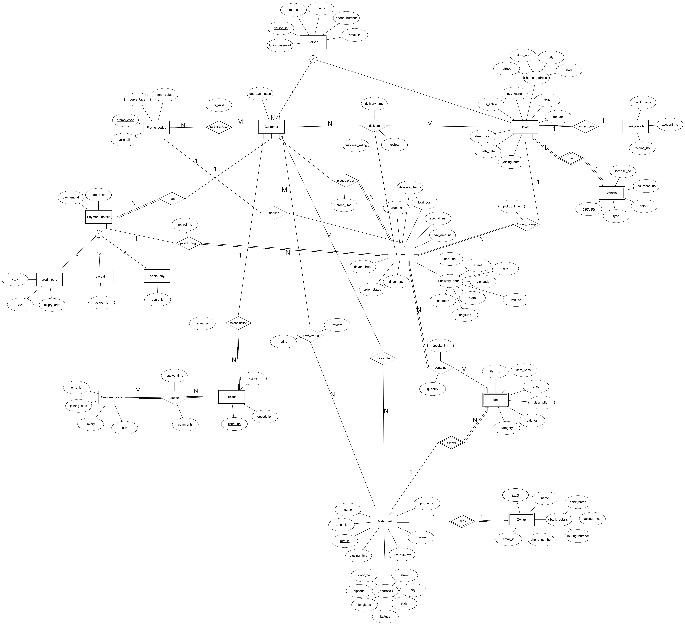

# Door Dash DB Design

The repo is an emulation of DoorDash Database model for DB Design Course.  

It starts from requirements gathering, penning down ER diagram, relational mapping and their normalizations and finally the DDL statements to create the schema.   

Used Oracle 19c (Oracle Cloud) for this project.   

Also, contains couple of PL/SQL block for sensible triggers and Stored Procedures

